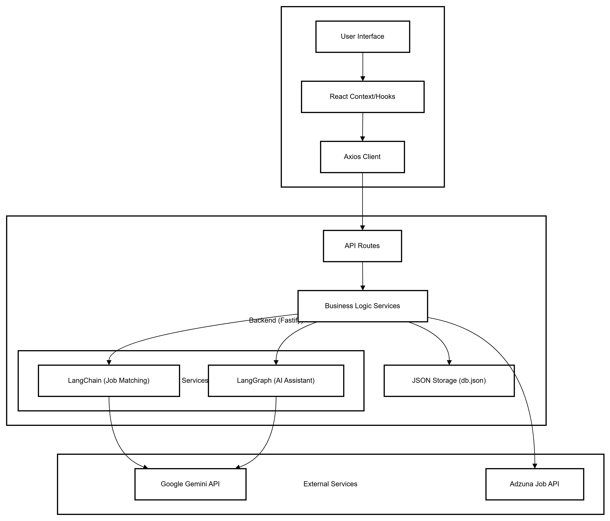

<<<<<<< HEAD

=======
# AI-Powered Job Tracker with Smart Matching

A premium, intelligent job application tracking platform that leverages **LangChain** and **LangGraph** to match users with their ideal roles and provide an interactive AI assistant for job discovery.

---

## 🏗️ Architecture Diagram

```mermaid

```

---

## 🚀 Setup Instructions

### Prerequisites
- **Node.js**: v18 or higher
- **npm**: v9 or higher
- **Google Gemini API Key**: Required for AI features. [Get it here](https://aistudio.google.com/).

### Local Setup Steps

1. **Clone the Repository**:
   ```bash
   git clone [your-repo-url]
   cd job-tracker
   ```

2. **Backend Setup**:
   ```bash
   cd backend
   npm install
   cp .env.example .env
   # Add your GOOGLE_API_KEY to .env
   npm run dev
   ```

3. **Frontend Setup**:
   ```bash
   cd ../frontend
   npm install
   npm run dev
   ```

4. **Access the App**:
   Open `http://localhost:3000` in your browser.

### Environment Variables

| Variable | Scope | Description |
| :--- | :--- | :--- |
| `GOOGLE_API_KEY` | Backend | Your Gemini API Key for matching/assistant. |
| `PORT` | Backend | Port for the API server (default: 3001). |
| `VITE_API_URL` | Frontend | URL of the backend API (default: http://localhost:3001/api). |

---

## 🧠 LangChain & LangGraph Usage

### LangChain Job Matching
We use LangChain's `ChatGoogleGenerativeAI` to power the `calculateJobMatch` service. 
- **Prompt Design**: A structured template analyzes skill overlap (40%), experience relevance (30%), title match (20%), and keyword density (10%).
- **Output Parsing**: We use `StringOutputParser` with a strictly enforced JSON schema to ensure predictable UI rendering of match reasoning.

### LangGraph AI Assistant
The AI Assistant is built using a **StateGraph** to manage complex, multi-turn conversations.

**Graph Structure & Nodes**:
1. `detect_intent`: Classifies the user message (e.g., FILTER_UPDATE, JOB_SEARCH).
2. `handle_support`: Provides static help or application/resume guidance.
3. `extract_filters`: uses the LLM to pull workMode, location, and salary filters from natural language.
4. `search_jobs`: Executes the backend job search logic based on extracted filters.
5. `generate_response`: Consolidates tools results into a natural language summary.

**State Management**:
- The graph maintains a `messages` array for history and a dynamic `filters` object that updates as the conversation progresses.
- **UI Interaction**: The assistant returns an `action` flag (e.g., `apply_filters`) which the frontend interprets to update the main job list without a page refresh.

---

## 🎯 AI Matching Logic

### Scoring Approach
The engine doesn't just look for keywords; it performs **Semantic Analysis**:
1. **Hard Skills (40%)**: Compares the resume's tech stack against the job description.
2. **Contextual Experience (30%)**: Evaluates if the candidate's past roles align with the current seniority level.
3. **Role Specificity (20%)**: Matches job titles and synonyms (e.g., "Fullstack" vs "MERN").
4. **Cultural Keywords (10%)**: Looks for soft skills and environment fit (e.g., "fast-paced", "remote-first").

### Performance Considerations
- **Truncation**: LLM input is capped to the 3000 most relevant characters to minimize token usage and latency.
- **Heuristic Fallback**: If the GEMINI API is unavailable, the system reverts to a local **Rule-Based TF-IDF** matching algorithm to ensure the app remains functional.

---

## 💭 Design Reflections

### Popup Flow Design (Critical Thinking)
We utilized a **Modal-First approach** (via Headless UI) for job details and application forms.
- **Choice**: Modals over full-page navigation.
- **Reasoning**: Maintains the user's scroll position and mental context in the dense job list.
- **Edge Cases**: Handled "click-outside" closures and "Esc" key escapes to ensure users never feel "trapped" in a flow.
- **Alternatives**: Considered an "expandable card" row but found it cluttered the grid layout on smaller screens.

### AI Assistant UI Choice
- **Choice**: **Sticky Sidebar Scroller**.
- **UX Reasoning**: On desktop, job searching is a "compare and contrast" activity. By placing the AI Assistant in a persistent sidebar, users can chat while simultaneously scanning the job results. It prevents the "ping-pong" navigation found in bubble-based designs.

---

## 📈 Scalability & Tradeoffs

### Scalability
- **100+ Jobs**: Handled via client-side memoization and virtualized list structures to prevent DOM lag.
- **10,000 Users**: The stateless backend architecture and JSON-based storage (currently) mean the API can be easily containerized and moved to a dedicated DB like PostgreSQL/Supabase for high concurrency.

### Tradeoffs & Improvements
- **Known Limitations**: The current `db.json` storage is not suitable for high-frequency writes (multi-user production).
- **Future Improvements**: 
  - Add **Vector Embeddings** (ChromaDB) for even faster semantic search across thousands of jobs.
  - Implement **WebSockets** for real-time application status updates.
  - Add **Social Auth** (OAuth) for easier onboarding.
>>>>>>> 23c7e08 (feat: finalize AI job tracker with smart matching, UI responsiveness, and production deployment configuration)
